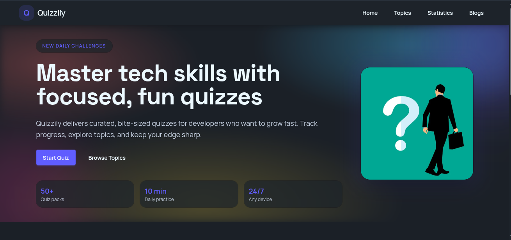

# Quizily

Quizily is a responsive quiz web app that helps learners practice, track progress, and visualize performance with clean, interactive UI.

## Live Demo

- `https://quiz-easily.web.app`

## Preview



## Tech Stack

- `React`
- `Vite`
- `Tailwind CSS`
- `DaisyUI`
- `React Router`
- `Recharts`
- `d3-scale-chromatic`
- `Kitwind Kometa UI`

## Features

- Clean, user-friendly quiz experience
- Responsive layout across devices
- Fast load times with Vite build pipeline
- Progress tracking and performance insights
- Visual statistics with charts
- Daily quiz activity support
- Simple navigation and accessible UI

## Getting Started

```bash
npm install
npm run dev
```

## Scripts

- `npm run dev` - Start local development server
- `npm run build` - Build for production
- `npm run preview` - Preview production build locally
